<div align="center">

  [](https://git.io/typing-svg)

  [](https://nextjs.org/)
  [](https://www.typescriptlang.org/)
  [](https://tailwindcss.com/)
  [](https://supabase.com/)

  <br />

  Welcome to **Vridhira**, a next-generation e-commerce platform that blends high-performance server rendering with fluid client-side interactivity.

  [View Demo](#) · [Report Bug](#) · [Request Feature](#)
</div>

<div align="center">
  <a href="#-gallery">Gallery</a> •
  <a href="#-installation--setup">Installation</a> •
  <a href="#-environment-variables">Configuration</a> •
  <a href="#-roadmap">Roadmap</a> •
  <a href="#-contributing--credits">Credits</a>
</div>

<br />

## 🧭 Navigation

<details>
<summary><b>📖 Project Philosophy & Architecture</b></summary>

> **"This isn't just a static website; it's a living application."**

Vridhira uses **React Server Components** for speed and SEO, while surgically injecting client-side interactivity into buttons, forms, and product cards.

We use **Shadcn UI** not just for looks, but for consistency. Every component is part of a larger design system, meaning when you update a button's style in the theme, it propagates everywhere. The backend isn't hidden away; it's directly accessible via typed Supabase clients, making data fetching seamless and type-safe.

### 🏗️ Architecture

```mermaid
graph TD
  User((👤 User)) -->|Interacts| UI[🖥️ Next.js UI]
  UI -->|Server Action| Server[⚡ Next.js Server]
  Server -->|Auth & Data| Supabase[🗄️ Supabase]
  Supabase -->|Realtime Update| UI
  
  subgraph Client
    UI
  end
  
  subgraph Backend
    Server
    Supabase
  end
```



</details>

<details>
<summary><b>🚀 Features & Modules</b></summary>

### Core Modules
*   **🛍️ Shop**: Browse and purchase products. See [`src/app/shop`](src/app/shop).
*   **🛒 Cart & Checkout**: Full cart management and secure checkout process. See [`src/app/cart`](src/app/cart) and [`src/app/checkout`](src/app/checkout).
*   **👤 User Accounts**: Customer profile and order management. See [`src/app/account`](src/app/account).
*   **🔐 Authentication**: Secure login and signup flows. See [`src/app/auth`](src/app/auth).

### Admin Dashboard
*   **📊 Activity & Analytics**: Monitor platform activity. See [`src/app/admin`](src/app/admin).
*   **🛡️ Role-Based Access**: Secure admin routes protected by permission logic.

</details>

<details>
<summary><b>🧩 Component Showcase (The "Magic")</b></summary>

We don't build pages; we assemble them from **smart components**.

Take our `ProductCard`. It encapsulates authentication, performant loading states, and optimistic UI updates so the parent page stays clean.

```tsx
// ⚡ The Magic: Smart Component Logic
const handleAddToCart = async () => {
  setIsAdding(true); // 1. Immediate Visual Feedback
  try {
    // 2. Server Action
    await addToCartAction(supabase, user?.id, { ... });
    // 3. Dynamic Toast Notification
    toast({ title: "Added to collection" }); 
  } finally {
    setIsAdding(false);
  }
};
```

### ⚙️ How it Works


</details>

<details>
<summary><b>🛠️ Tech Stack Details</b></summary>

*   **Framework**: [Next.js 15](https://nextjs.org/) (App Router)
*   **Language**: [TypeScript](https://www.typescriptlang.org/) (Strict mode)
*   **Styling**: [Tailwind CSS](https://tailwindcss.com/) with [Radix UI](https://www.radix-ui.com/)
*   **Database**: [Supabase](https://supabase.com/) (PostgreSQL)
*   **Forms**: [React Hook Form](https://react-hook-form.com/) + [Zod](https://zod.dev/)
*   **Date Handling**: [date-fns](https://date-fns.org/)

</details>

<details>
<summary><b>📸 Gallery</b></summary>

| **Dashboard** | **Mobile View** |
|:---:|:---:|
|  |  |

</details>

---

## ⚡ Quick Start & Deployment

<details>
<summary><b>⚡ Installation & Setup</b></summary>

Follow these steps to get the project running locally in minutes.

1.  **Clone & Install**
    ```bash
    git clone <repository-url>
    cd vridhira.in
    npm install
    ```

2.  **Lift Off!**
    ```bash
    npm run dev
    ```
    Open [http://localhost:3000](http://localhost:3000) to see your app live.

</details>

<details>
<summary><b>🔌 Environment Variables</b></summary>

Create a `.env.local` file in the root directory.

| Variable | Description | Required |
| :--- | :--- | :---: |
| `NEXT_PUBLIC_SUPABASE_URL` | Your Supabase Project URL | ✅ |
| `NEXT_PUBLIC_SUPABASE_ANON_KEY` | Your Supabase Anon Key (Safe for client) | ✅ |
| `GOOGLE_GENAI_API_KEY` | Key for Genkit AI features (Optional) | ❌ |

</details>

<details>
<summary><b>🌍 Deployment</b></summary>

The easiest way to deploy is to use the [Vercel Platform](https://vercel.com/new).

[](https://vercel.com/new/clone?repository-url=https%3A%2F%2Fgithub.com%2Fyour-repo)

</details>

<details>
<summary><b>🗺️ Roadmap</b></summary>

- [ ] 🌙 Dark Mode toggle
- [ ] 💳 Stripe Payment Integration
- [ ] 📧 Email Notifications
- [ ] 🔍 Search & Filtering
- [ ] 📱 React Native Mobile App

</details>

---

## 📂 Visual Map

```
vridhira/
├── src/
│   ├── app/                 # 🚦 Routes & Pages
│   │   ├── api/             # 🔌 Backend API
│   │   └── shop/            # 🛍️ Storefront
│   ├── components/          # 🧩 Building Blocks
│   │   └── ui/              # 🎨 Design System
│   └── lib/                 # 🧠 Core Logic
│       └── supabase/        # 🗄️ Database Client
└── public/                  # 🖼️ Assets
```


## 🤝 Contributing & Credits

**Created and maintained by [Himanshu](https://github.com/Himanshu-profile-placeholder).**

We are open for collaborators! Whether you're fixing a bug, improving documentation, or proposing a new feature, your contributions are welcome.

<div align="center">
  <br />
  <sub>Built with ❤️ by Himanshu. Open for collaboration!</sub>
</div>
